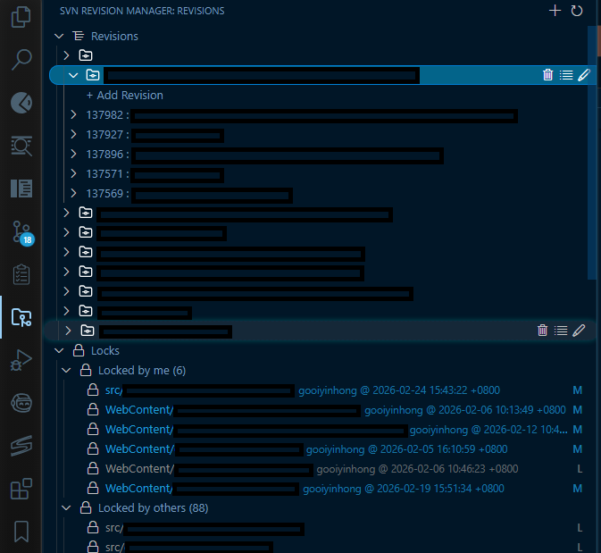
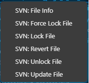

# SVN Revision Manager

Manage SVN revisions, locks, and file operations directly from VS Code — with multi-repo support.

## Features

- **Multi-repo support** — configure multiple SVN working folders, each with its own Revisions & Locks section
- **Revision groups** — organize revisions into named groups with auto-fetched commit messages
- **Lock management** — lock, force lock, unlock files from the sidebar or Explorer context menu
- **File status tracking** — New Files, Modified (Locked), Modified (Not Locked) sections
- **File decorations** — visual indicators for locked, modified, unversioned, and ignored files in Explorer
- **Status bar** — shows lock owner and date for the active file
- **File operations** — Revert, Update, and SVN Info via right-click

## Screenshots

### SVN Revision Manager Sidebar

### Lock Management

## Requirements

- SVN command-line tool installed and accessible
- Access to an SVN repository

## Settings

| Setting | Description |
|---------|-------------|
| `svnRevisionGroup.workingFolders` | List of SVN working copy folder paths |
| `svnRevisionGroup.svnPath` | Path to `svn.exe` (default: `"svn"`) |
| `svnRevisionGroup.dataPath` | Custom path to store revision data (optional) |

## Quick Start

1. Set your SVN working folders in settings (`svnRevisionGroup.workingFolders`)
2. Open the **SVN Revision Manager** sidebar
3. Create groups under a repo's Revisions section and add revision numbers
4. Use the Locks section to view new files, locked files, and modified files
5. Right-click files in Explorer or the sidebar for SVN operations